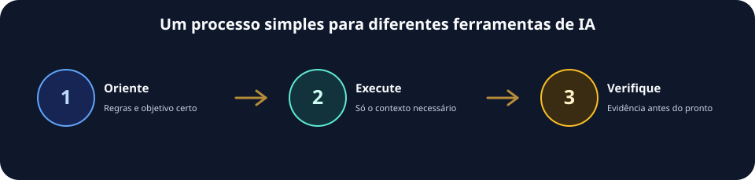
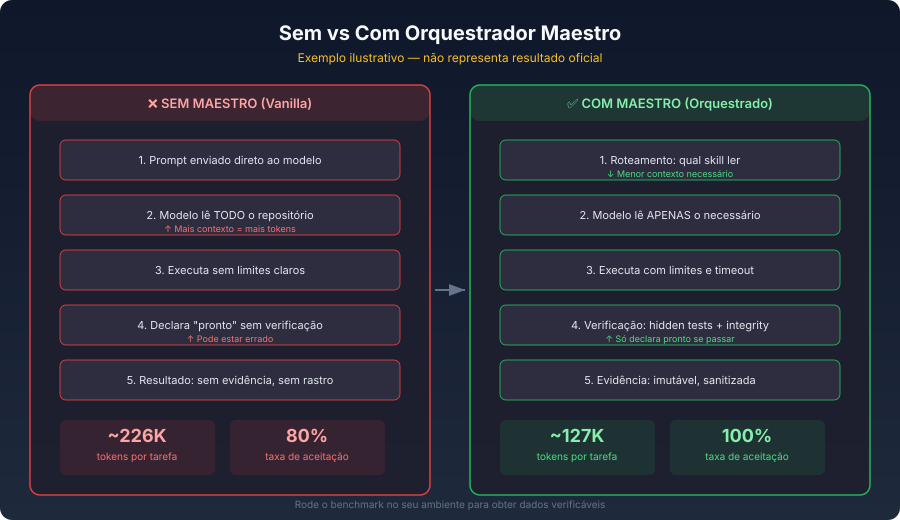
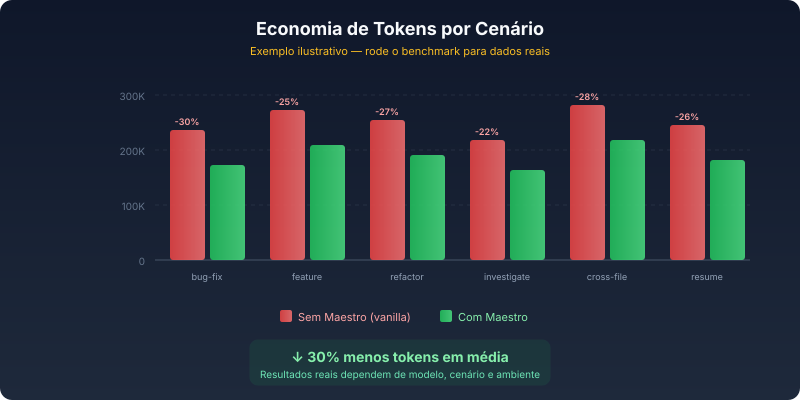

# Orquestrador Maestro

<p align="center">
  
</p>

<p align="center"><a href="README.md">Português</a> · <a href="docs/skills/README.md">Skills (PT)</a> · <a href="docs/installation.md">Install</a> · <a href="docs/benchmark.md">Benchmark</a> · <a href="CONTRIBUTING.md">Contribute</a></p>

> Use the same process across different AI tools: understand the task, read the necessary context, work within clear limits, verify the result, and leave useful state for the next session.

Orquestrador Maestro is for people who use Codex, Claude, OpenCode, Cursor, Gemini, and other AI tools on real projects. It is not a model and does not replace your preferred tool. It prepares the environment so tools spend less context, behave more predictably, and provide evidence before declaring work complete.

### Choose your next step

- [Understand the idea](#why-use-it)
- [Install now](#get-started-in-two-minutes)
- [Run the benchmark](#benchmark-run-it-on-your-machine)
- [Choose a skill](docs/skills/choose.md)
- [Read the technical guides](#keep-exploring)

## Why use it

With only a prompt, an AI can read too much, improvise its process, and call a task done without enough proof. Maestro organizes the path before execution.

| Without orchestration | With Orquestrador Maestro |
| --- | --- |
| The AI decides what to read alone | It starts with the right rules, state, and skill |
| Context grows without a boundary | It reads the minimum needed and deepens on demand |
| “Done” may only be an assertion | Verification and handoff are part of the work |
| Every tool invents its own ritual | The process carries across tools and sessions |



## Get started in two minutes

Requires Node.js 20.19 or later.

```bash
npm install -g @iapro/orquestrador-maestro-cli@latest
orquestrador-maestro install
orquestrador-maestro verify
```

The [installation guide](docs/installation.md) covers Windows, Linux, macOS, bootstrap, dry runs, and rollback.

**Next step:** [verify the installation](docs/installation.md#verificação), then [set up your first project](docs/project-dev-hierarchy.md).

## Benchmark: run it on your machine

The benchmark compares conditions with the same scenario, model, and acceptance criteria. It counts tokens only for accepted tasks and keeps evidence for review.



> **Illustrative example.** The values in this graphic are not a promise or official result. Actual outcomes vary by model, task, and environment. Run the benchmark to produce and inspect your own evidence.



The [benchmark methodology](docs/benchmark.md) explains its evidence gate, limitations, metrics, and reproducibility.

**Next step:** [inspect the generated evidence](docs/benchmark.md#evidence) before publishing a number.

## Skills: specialization on demand

Skills are specialized capabilities routed by goal, risk, and environment. Not every skill needs to be installed in every tool: some are **native**, some are available **on demand**, and some are **conditional** because they require a service, browser, or explicit authorization.

The detailed skills documentation is currently in Portuguese. Use the equivalent navigation below:

- [Choose by objective (PT)](docs/skills/choose.md)
- [Recipes and combinations (PT)](docs/skills/recipes.md)
- [Full reference catalog (PT)](docs/skills/reference/README.md)

## Keep exploring

- [Installation](docs/installation.md)
- [How agents work with Maestro](docs/ai-agent-operating-guide.md)
- [Context economy](docs/context-economy.md)
- [Engineering quality](docs/engineering-quality.md)
- [Skills portal (detailed documentation in Portuguese)](docs/skills/README.md)
- [Privacy model](docs/privacy-model.md)
- [Full technical documentation](docs/)

## Next step

**[Install Maestro](docs/installation.md)**, then **[run the benchmark](docs/benchmark.md#quick-start)** in your environment. Improvements are welcome through [contributions](CONTRIBUTING.md).
