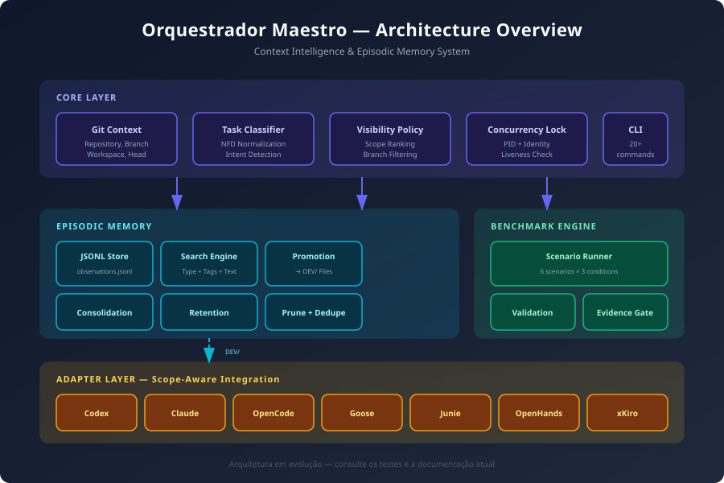
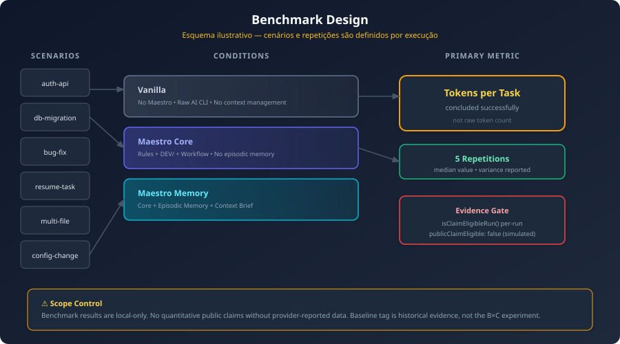

# Orquestrador Maestro

Camada pública e sanitizada para padronizar o trabalho de pessoas e agentes de IA em projetos reais.

O Orquestrador Maestro organiza regras, contexto, skills, hooks, perfis de ferramentas e memória operacional para que diferentes IAs sigam o mesmo processo: entender o objetivo, ler apenas o contexto necessário, executar com limites claros, verificar o resultado e deixar o trabalho recuperável para a próxima sessão.

> O Orquestrador não é um modelo de IA, não hospeda agentes e não substitui Codex, Claude, OpenCode, Cursor, Gemini, Grok, MiMo Code, Kimi Code, Windsurf, Antigravity ou outras ferramentas. Ele prepara o ambiente para que essas ferramentas trabalhem com um contrato comum.

[GitHub](https://github.com/IAPro-Community/Orquestrador-Maestro) · [Pacote npm](https://www.npmjs.com/package/@iapro/orquestrador-maestro-cli) · [Changelog](CHANGELOG.md)

> Revisão pública mais recente: `2026-09-08` (`0.2.8`).

## Para quem este projeto é

- Para quem usa mais de uma ferramenta de IA e quer preservar o mesmo padrão de trabalho.
- Para equipes que precisam de instruções globais, segurança, verificação e continuidade entre sessões.
- Para pessoas técnicas que querem uma instalação reproduzível, revisável e compatível com Windows, Linux e macOS.
- Para autores de skills, hooks, perfis e automações que precisam de um ponto central de roteamento.
- Para agentes de IA que precisam descobrir rapidamente quais regras, arquivos e skills devem ler.

## A ideia em uma frase

O Maestro define o objetivo; o Orquestrador garante que a IA leia as regras certas, use o menor contexto suficiente, execute com segurança, verifique o trabalho e registre o estado do projeto.

~~~mermaid
flowchart LR
    A[Pedido do Maestro] --> B[Contrato global]
    B --> C[Regras do projeto]
    C --> D[Memória DEV]
    D --> E[Roteador de skills]
    E --> F[Execução na ferramenta]
    F --> G[Verificação proporcional]
    G --> H[Handoff e worklog]
    H -. próxima sessão .-> C
~~~

## Capacidades atuais

Além do fluxo padrão de instalação e execução, o snapshot atual oferece:

- contratos declarativos e opt-in para workflows, tarefas e workspaces, com etapas, eventos, gates humanos, retry manual, dependências, artefatos e isolamento por repositório;
- locks determinísticos versionáveis e state local-only para retomar workflows com digest, gates humanos e proteção contra drift;
- o perfil `phase-loop`, que organiza trabalhos maiores em `discuss`, `plan`, `execute`, `verify` e `ship` sem alterar o caminho padrão;
- briefing econômico de contexto, roteamento por índices compactos e gates dedicados para validar a hierarquia e os artefatos de `DEV/`;
- instalação, atualização, diagnóstico, dry-run, sincronização de skills e verificação multiplataforma;
- composição de experiências web premium, com narrativa, direção visual, movimento, conversão, acessibilidade, performance e QA visual responsivo;
- integração global com Codex, Claude Code, OpenCode, Cursor, Gemini CLI, Grok CLI, MiMo Code, Kimi Code, Windsurf e Antigravity;
- telemetria desabilitada por padrão, memória opcional e controles para manter efeitos externos sujeitos à autorização humana.

Os contratos de workflow são descritivos: não executam agentes, não criam integrações obrigatórias e não autorizam commit, push, publicação ou compartilhamento. Consulte os [workflows declarativos](docs/workflows.md), os [contratos de tarefa e workspace](docs/task-and-workspace-contracts.md) e o [histórico completo](CHANGELOG.md) para detalhes e migrações.

### Lock e state de workflow

Para um projeto consumidor, gere um lock revisável em `DEV/WORKFLOWS/` e inicialize o cursor privado em `.local/`:

~~~bash
orquestrador-maestro workflow-lock generate --project-path . --task-id task/minha-tarefa --workflow plan-build-verify --out DEV/WORKFLOWS/minha-tarefa.lock.json
orquestrador-maestro workflow-state init --project-path . --lockfile DEV/WORKFLOWS/minha-tarefa.lock.json
orquestrador-maestro workflow-state validate --project-path . --task-id task/minha-tarefa
orquestrador-maestro workflow-state get --project-path . --task-id task/minha-tarefa
~~~

O lock é versionável e não contém paths absolutos ou dados locais. O state fica em `.local/orquestrador/workflow-state/`, exige que `.local/` já esteja ignorado no Git e nunca é lido pelo briefing de contexto. Avanços atravessando gates humanos exigem aprovação explícita:

~~~bash
orquestrador-maestro workflow-state approve --project-path . --task-id task/minha-tarefa --kind plan --by "nome-do-responsavel"
orquestrador-maestro workflow-state advance --project-path . --task-id task/minha-tarefa --to-step plan
~~~

## Benchmark: medição de contexto

### Como rodar na sua máquina

~~~bash
# Clonar o repositório
git clone https://github.com/IAPro-Community/Orquestrador-Maestro.git
cd Orquestrador-Maestro

# Rodar todos os testes
npm test

# Rodar o benchmark real (requer API keys)
node benchmarks/real-ai-benchmark.js

# Ver resultados
cat benchmarks/results/real/real-ai-benchmark-report.json
~~~

### O que esta medição demonstra

Existem dois tipos de benchmark:

- **Sintético/infraestrutura** (`npm test`): valida cenários com fixtures locais. Não executa modelo de IA nem coleta tokens de provider.
- **Provider API smoke** (`node benchmarks/real-ai-benchmark.js`): chama APIs reais (Anthropic/OpenAI) usando `ANTHROPIC_API_KEY` e `OPENAI_API_KEY`. Coleta tokens reportados pelo provider. Não é elegível para afirmações de performance do Maestro (`publicClaimEligible: false`).

Ambos os tipos não medem qualidade de código, produtividade, custo ou redução de bugs. Os resultados variam com o commit, ambiente e cenários; portanto não devem ser usados como promessa geral de desempenho.

Os cenários e o código estão em [`benchmarks/scenarios/`](benchmarks/scenarios/) e [`benchmarks/real-ai-benchmark.js`](benchmarks/real-ai-benchmark.js). Os resultados do provider smoke são gerados localmente em `benchmarks/results/ai-real/` e não fazem parte do pacote público.

### Smoke test opcional com xKiro

Para validar uma integração OpenAI-compatible sem incluir credenciais no código, configure `XKIRO_API_KEY` no ambiente ou em um `.env` local e execute:

~~~bash
XKIRO_MODEL=qwen/qwen3-vl-plus:free npm run test:xkiro
~~~

O script usa `qwen/qwen3-vl-plus:free` por padrão, aceita `XKIRO_MODEL` para outro modelo e exibe somente status, modelo, resposta e uso. Ele não mede qualidade de agentes, produtividade ou economia. Consulte a [documentação de Chat Completions do xKiro](https://docs.xkiro.com/api/chat-completions/) para o contrato da API.

## Comece em dois minutos

### Instalação recomendada por npm

Requer Node.js 18 ou superior.

~~~bash
npm install -g @iapro/orquestrador-maestro-cli@latest
orquestrador-maestro install
orquestrador-maestro verify
~~~

O pacote npm instala a CLI. Os arquivos do usuário só são alterados quando install ou update é executado.

### Instalação direta pelo bootstrap

Windows PowerShell:

~~~powershell
irm https://raw.githubusercontent.com/IAPro-Community/Orquestrador-Maestro/main/scripts/bootstrap-install.ps1 | iex
~~~

Linux ou macOS:

~~~bash
curl -fsSL https://raw.githubusercontent.com/IAPro-Community/Orquestrador-Maestro/main/scripts/bootstrap-install.sh | bash
~~~

Para uma instalação normal, não use sudo nem abra o PowerShell como Administrador. Os bootstraps configuram a instalação no perfil do usuário, ajustam o PATH, instalam a CLI e executam a verificação.

### Instalação a partir do clone

Windows:

~~~powershell
git clone https://github.com/IAPro-Community/Orquestrador-Maestro.git
Set-Location Orquestrador-Maestro
powershell -NoProfile -ExecutionPolicy Bypass -File .\install.ps1
powershell -NoProfile -ExecutionPolicy Bypass -File .\scripts\verify-install.ps1
~~~

Linux ou macOS:

~~~bash
git clone https://github.com/IAPro-Community/Orquestrador-Maestro.git
cd Orquestrador-Maestro
bash install.sh
bash scripts/verify-install.sh
~~~

Antes de gravar qualquer arquivo, use uma prévia:

~~~powershell
powershell -NoProfile -ExecutionPolicy Bypass -File .\install.ps1 -DryRun
~~~

~~~bash
bash install.sh --dry-run
~~~

## Como o Orquestrador funciona

O sistema tem cinco camadas:

| Camada | Responsabilidade | Fonte principal |
| --- | --- | --- |
| Contrato global | Define hierarquia, segurança, qualidade e persistência | .orquestrador/rules.md, maestro.md, PERSISTENCE.md |
| Entrada da ferramenta | Faz a IA encontrar o contrato no formato que ela entende | AGENTS.md, CLAUDE.md, GEMINI.md e equivalentes |
| Contexto do projeto | Guarda arquitetura, decisões, estado, verificações e próximo passo | AGENTS.md do projeto e DEV/ |
| Roteamento | Escolhe perfil, skill principal e combinações permitidas | SKILLS_INDEX.md, SKILLS_ROUTER.json, aliases e chains |
| Execução e manutenção | Instala, sincroniza, verifica, diagnostica e compacta memória | CLI, scripts, hooks e perfis |

O fluxo de leitura recomendado é:

~~~text
rules.md → maestro.md → PERSISTENCE.md → AGENTS.md do usuário
→ AGENTS.md do projeto → DEV/ → skill específica
~~~

O AGENTS.md mais próximo pode acrescentar regras do projeto. Se houver conflito, a instrução local do projeto prevalece sobre a global, respeitando o contrato de segurança e as regras de edição do repositório.

### O que acontece durante uma tarefa

1. A IA observa o pedido, o projeto atual e as autorizações disponíveis.
2. Lê o contrato global e as instruções do projeto.
3. Consulta o índice e o roteador de skills, sem carregar o catálogo inteiro.
4. Escolhe o menor perfil e a menor combinação de skills capazes de resolver a tarefa.
5. Executa as alterações dentro do escopo autorizado.
6. Verifica com teste, lint, build, validação, inspeção ou outra evidência adequada.
7. Relata mudanças, verificações e riscos restantes.
8. Em trabalho substancial, atualiza DEV/WORKLOG.md, DEV/VERIFY.md e DEV/HANDOFF.md.

Para trabalhos maiores, o perfil opt-in `phase-loop` explicita as fases `discuss`, `plan`, `execute`, `verify` e `ship`. A versão 2 dos schemas preserva os campos legados e acrescenta eventos, gates humanos, retry manual e referências de workspace. Paralelismo exige isolamento explícito; commit, push, publicação e compartilhamento permanecem gates separados.

## Economia de contexto

O projeto mantém as bibliotecas completas de skills instaladas, mas evita colocar todo esse conteúdo nas raízes que as ferramentas enumeram automaticamente.

- ~/.orquestrador/skills: fonte canônica e catálogo operacional.
- ~/.orquestrador/skill-library/community-skills: biblioteca comunitária completa.
- ~/.orquestrador/skill-library/codex-skills: workflows e skills do Codex/OMX.
- Raízes nativas como ~/.codex/skills, ~/.claude/skills, ~/.cursor/skills e equivalentes: conjunto enxuto sincronizado para descoberta rápida.

O princípio é carregar primeiro índices e roteadores compactos e só abrir a SKILL.md da tarefa. Isso reduz custo de contexto, evita decisões conflitantes e mantém o comportamento previsível.

## Memória de projeto com DEV/

DEV/ é uma convenção opcional para preservar contexto operacional no próprio projeto. Ela não é um banco de dados nem uma memória privada do Orquestrador; são arquivos versionáveis e legíveis por pessoas e ferramentas diferentes.

Crie a estrutura:

~~~bash
orquestrador-maestro init-dev --project-path .
~~~

Arquivos principais:

| Arquivo | Para que serve |
| --- | --- |
| DEV/README.md ou DEV/INDEX.md | Entrada e mapa da documentação |
| DEV/HANDOFF.md | Estado atual, riscos e próxima ação |
| DEV/CONTEXT.md | Contexto vivo, comandos e decisões |
| DEV/SPECS/ACTIVE.md | Escopo, critérios e plano de verificação da tarefa ativa |
| DEV/VERIFY.md | Evidências e resultados das verificações |
| DEV/WORKLOG.md | Histórico curto do trabalho substancial |
| DEV/ARCHITECTURE.md, API/, ADR/, RUNBOOKS/ | Detalhes por domínio, quando necessários |

Para manter a memória curta e útil:

~~~bash
orquestrador-maestro check-dev-gates --project-path . --max-entries 12 --strict
orquestrador-maestro compact-worklog --project-path . --keep 12
~~~

A IA deve começar pelos arquivos compactos e abrir apenas os documentos relevantes para a tarefa. Ao trocar de ferramenta ou encerrar um trabalho importante, o estado deve ficar nos arquivos DEV/, e não apenas no histórico da conversa.

## Skills, perfis e hooks

### Skills

Skills são playbooks especializados: por exemplo, revisão de código, debugging, segurança, SaaS, pagamentos, RLS, integrações, processamento de mídia e pesquisa. O roteador usa o pedido, aliases e evidências do projeto para escolher uma skill principal.

Arquivos de controle:

| Arquivo | Função |
| --- | --- |
| SKILLS_INDEX.md | Índice compacto para descobrir os próximos arquivos |
| SKILLS_ROUTER.json | Gatilhos, caminhos, custo e perfil de segurança |
| SKILL_ALIASES.json | Termos alternativos que apontam para skills |
| SKILL_CHAINS.json | Skills que podem ser combinadas após a principal |
| SKILL_EXECUTION_PROFILES.json | Perfis fast, standard, deep, multiagent, saas e security |
| SKILL_USAGE_SCHEMA.json | Formato opcional para registrar o uso de skills |

Perfis de execução:

| Perfil | Uso | Característica |
| --- | --- | --- |
| fast | Ajustes pequenos e respostas diretas | Uma skill, sem delegação |
| standard | Maioria das tarefas | Até três skills, contexto progressivo |
| deep | Mudanças amplas ou de maior risco | Até cinco skills, pode delegar |
| multiagent | Frentes independentes ou pedido explícito de agentes | Execução paralela com integração central |
| saas | SaaS, tenancy, pagamentos e admin | Gates de projeto e segurança |
| security | Auditoria defensiva autorizada | Requer escopo autorizado |

### Hooks

No Orquestrador, hooks são lembretes e verificações operacionais. Eles orientam preflight, roteamento, orçamento de contexto, sincronização, persistência e conclusão. Alguns perfis também instalam hooks de Git, mas isso é separado e deve ser autorizado no repositório correspondente.

Um hook deve apontar para o contrato central; não deve duplicar um catálogo inteiro de skills. Assim, Codex, Claude, OpenCode, Cursor, Gemini, Grok, MiMo Code, Kimi Code, Windsurf e Antigravity seguem a mesma fonte de verdade.

## O que é instalado

O instalador usa o home do usuário atual: %USERPROFILE% no Windows e $HOME no Linux/macOS.

| Destino | Conteúdo |
| --- | --- |
| .orquestrador/ | Núcleo canônico: regras, roteadores, hooks, scripts, skills e bibliotecas |
| AGENTS.md | Contrato global que agentes compatíveis podem ler |
| .codex/skills, .codex/agents, .codex/prompts | Skills, agentes e prompts nativos do Codex |
| .claude, .opencode, .cursor, .gemini, .windsurf, .mimo, .kimi-code, .grok | Entrypoints, regras, hooks, configurações e skills mínimas |
| .antigravity-skills e .ai-standards | Compatibilidade e padrões portáveis do Antigravity |
| .orquestrador-public-backups/ | Backups dos arquivos gerenciados que foram substituídos |

O instalador não instala modelos, logins, credenciais, chaves de API, sessões ou configurações privadas das ferramentas.

## Ferramentas suportadas

O pacote prepara integração global para Codex, Claude Code, OpenCode, Cursor, Gemini CLI, Grok CLI, MiMo Code, Kimi Code, Windsurf e Antigravity. Cada ferramenta continua responsável por seu próprio runtime, login, modelo, extensão e credenciais.

Para VS Code/GitHub Copilot, Continue, JetBrains AI Assistant, Aider, Cline e outros fluxos baseados no projeto, o caminho suportado é inicializar DEV/ no repositório e usar os arquivos de instrução/entrypoint criados pelo bootstrap quando aplicável.

### Adaptadores de ferramentas em alta

O Maestro também possui um catálogo declarativo para ferramentas AI-native e renderização segura por projeto. A primeira fatia executável cobre Junie CLI, Goose e OpenHands; Continue, Cline, GitHub Copilot CLI, Ollama e LM Studio já aparecem no catálogo para inspeção e serão habilitados gradualmente.

```text
orquestrador-maestro adapters list
orquestrador-maestro adapters paths junie
orquestrador-maestro adapters render junie --project-path . --dry-run
orquestrador-maestro adapters render junie --project-path . --apply
```

O `render` usa simulação por padrão; `--apply` é obrigatório para gravar. Ele cria somente arquivos de instrução, skills e agentes do projeto, preservando arquivos existentes. Não instala a ferramenta, não escolhe modelo ou provedor e não gerencia login, credenciais, MCP, extensões, sessões, cache, logs ou histórico. OpenHands continua exigindo seu ambiente suportado, incluindo WSL no Windows.

## Arquitetura



### Componentes Principais

| Componente | Descrição |
|------------|-----------|
| **Git Context Resolver** | Resolve repository, workspace, branch, detached, head commit em uma única chamada |
| **Task Classifier** | Classifica intent em trivial/bounded/complex/resumed/investigation com NFD normalization |
| **Visibility Policy** | Filtra e rankeia observações por scope (repository → workspace → branch) |
| **Concurrency Lock** | PID-based lock com identity verification e liveness check |
| **Episodic Memory** | JSONL store com search, timeline, consolidation, retention, prune |
| **Context Brief** | Monta briefing com DEV/ files, memory observations, e budget trimming |
| **Adapter Layer** | Integração scope-aware com Codex, Claude, OpenCode, Goose, Junie, OpenHands, xKiro |
| **Benchmark Engine** | 6 cenários × 3 condições × 5 repetições com evidence gate |

### Memory Scopes


As observações são automaticamente escopadas por Repository → Workspace → Branch. A política de visibilidade filtra e rankeia por scope mais específico, com boost para observações verificadas.

### Benchmark Flow



O benchmark compara 3 condições (Vanilla, Maestro Core, Maestro Memory) em 6 cenários sintéticos, com 5 repetições cada. A métrica principal é tokens por tarefa concluída com sucesso.

### Context Brief Flow


O context brief monta o briefing integrando git context, visibility policy, task classifier, DEV/ files e memory observations, com budget trimming para evitar overflow.

Depois da instalação, uma solicitação útil para qualquer IA é:

~~~text
Use o Orquestrador Maestro instalado neste usuário.
Leia primeiro o contrato global, depois o AGENTS.md do projeto e a pasta DEV/, se existirem.
Consulte o roteador de skills, resolva a tarefa com o menor contexto suficiente,
verifique o resultado e não faça commit nem push sem minha autorização.
~~~

## Memória Episódica

### O que é

A memória episódica permite registrar e buscar decisões, problemas, descobertas e implementações ao longo do tempo. Cada observação é salva em JSONL e pode ser buscada por tipo, tags ou texto. Observações são automaticamente escopadas por branch, workspace ou tarefa.

### Como usar

~~~bash
# Registrar uma decisão
orquestrador-maestro memory record \
  --project meu-projeto \
  --type decision \
  --summary "Usei JWT para autenticação" \
  --tags "auth,jwt" \
  --verified

# Registrar um problema
orquestrador-maestro memory record \
  --project meu-projeto \
  --type problem \
  --summary "Bug no refresh token" \
  --details "TokenService permite múltiplos refreshes" \
  --files "src/services/TokenService.ts" \
  --tags "bug,security"

# Buscar observações
orquestrador-maestro memory search \
  --project meu-projeto \
  --search "auth"

# Ver timeline
orquestrador-maestro memory timeline \
  --project meu-projeto

# Ver estatísticas
orquestrador-maestro memory stats \
  --project meu-projeto
~~~

### Tipos de observação

| Tipo | Uso |
|------|-----|
| `decision` | Decisões arquiteturais e de design |
| `discovery` | Descobertas durante exploração |
| `problem` | Bugs e problemas encontrados |
| `implementation` | Implementações e mudanças de código |
| `verification` | Resultados de testes e validações |
| `risk` | Riscos identificados |
| `dependency` | Dependências e integrações |
| `attempt` | Tentativas de execução (comandos, testes) |
| `failure` | Falhas e erros |
| `environment` | Configurações de ambiente |
| `workaround` | Soluções temporárias |

### Exemplo prático

~~~bash
# 1. Registrar decisão
$ orquestrador-maestro memory record --project auth --type decision --summary "JWT para APIs"
→ obs_dbd7d7ee59754ab6

# 2. Registrar problema
$ orquestrador-maestro memory record --project auth --type problem --summary "Refresh token bug"
→ obs_7809825090b6d182

# 3. Buscar
$ orquestrador-maestro memory search --project auth --search "token"
→ [2 observações encontradas]

# 4. Verificar
$ orquestrador-maestro memory stats --project auth
→ { total: 2, byType: { decision: 1, problem: 1 }, verified: 1 }
~~~

## Referência da CLI

~~~text
orquestrador-maestro install [opções]
orquestrador-maestro update [opções]
orquestrador-maestro verify [opções]
orquestrador-maestro doctor
orquestrador-maestro init-dev --project-path PATH
orquestrador-maestro compact-worklog --project-path PATH --keep N
orquestrador-maestro check-dev-gates --project-path PATH --max-entries N --strict
orquestrador-maestro context brief --project-path PATH --task TEXT
orquestrador-maestro workflow-lock <generate|validate> [opcoes]
orquestrador-maestro workflow-state <init|get|validate|approve|advance> [opcoes]
orquestrador-maestro adapters <list|paths|validate> [id]
orquestrador-maestro adapters render <junie|goose|openhands> --project-path PATH [--dry-run|--apply]
orquestrador-maestro memory record --project PATH --type TYPE --summary TEXT [opcoes]
orquestrador-maestro memory search --project PATH [--search TEXT] [--type TYPE] [--branch BRANCH]
orquestrador-maestro memory show --project PATH --id OBS_ID
orquestrador-maestro memory timeline --project PATH [--limit N]
orquestrador-maestro memory stats --project PATH
orquestrador-maestro memory list-projects
orquestrador-maestro memory promote --id OBS_ID --destination PATH [--apply]
orquestrador-maestro memory status [--project PATH]
orquestrador-maestro memory dedupe --project PATH
orquestrador-maestro memory retention --project PATH [--max-age-days N] [--max-count N]
orquestrador-maestro memory prune --project PATH [--keep-recent N] [--keep-verified]
orquestrador-maestro memory consolidate --project PATH --ids OBS_ID,OBS_ID
orquestrador-maestro memory cleanup --project PATH
orquestrador-maestro benchmark list
orquestrador-maestro benchmark run --scenario ID --condition CONDITION
orquestrador-maestro changelog [--full]
orquestrador-maestro list-targets
orquestrador-maestro dry-run
orquestrador-maestro uninstall
orquestrador-maestro telemetry [status|enable|disable|endpoint|test]
orquestrador-maestro version [--check]
~~~

Opções importantes de instalação e atualização:

| Opção | Efeito |
| --- | --- |
| --dry-run | Mostra o plano sem gravar arquivos |
| --home-path PATH | Usa outro home, útil para testes isolados |
| --core-only | Instala apenas .orquestrador e AGENTS.md |
| --only codex,cursor | Limita a instalação aos componentes escolhidos |
| --no-tool-profiles | Não instala perfis globais das ferramentas |
| --skip-community-skills | Não copia a biblioteca comunitária offload |
| --skip-skill-sync | Não sincroniza skills nas raízes nativas |
| --no-force | Evita forçar substituição de arquivos existentes |
| --list-targets | Lista destinos reconhecidos pelo instalador |
| --uninstall | Remove arquivos gerenciados de forma conservadora |
| --verbose-paths | Mostra caminhos reais nos relatórios |

Explore todas as opções com:

~~~bash
orquestrador-maestro --help
~~~

## Atualizar, testar e remover

Atualização da CLI e dos arquivos instalados:

~~~bash
orquestrador-maestro update
orquestrador-maestro verify
orquestrador-maestro doctor
~~~

O comando `update` atualiza a CLI global para `latest` antes de reaplicar os arquivos. Para atualizar somente o pacote npm, use `npm install -g @iapro/orquestrador-maestro-cli@latest --force --prefer-online`.

Para conferir sem alterar arquivos se a CLI instalada está atrás do npm, use `orquestrador-maestro version --check`. O comando informa a versão local, o `latest` publicado e o comando de atualização quando houver diferença.

Atualização a partir do clone:

~~~bash
git pull
bash install.sh
bash scripts/verify-install.sh
~~~

No Windows, use git pull, install.ps1 e scripts/verify-install.ps1.

O instalador cria backups antes de substituir arquivos gerenciados. O uninstall é conservador: remove o que pertence ao snapshot público e preserva conteúdo não mapeado. Faça dry-run antes de uma remoção que precise ser revisada.

## Telemetria e privacidade

A telemetria é desabilitada por padrão. Nenhum evento é enviado sem endpoint configurado e habilitação explícita.

~~~bash
orquestrador-maestro telemetry status
orquestrador-maestro telemetry endpoint https://seu-dominio.example/api/orquestrador-telemetry
orquestrador-maestro telemetry enable
orquestrador-maestro telemetry test
orquestrador-maestro telemetry disable
~~~

Quando habilitada, a implementação envia apenas metadados operacionais mínimos, como comando, plataforma, arquitetura, versão major do Node.js, sucesso e identificador anônimo. Não envia prompts, conteúdo de projetos, caminhos locais, tokens, logs ou nome do usuário. Consulte [`docs/npm-package.md`](docs/npm-package.md) e [`docs/privacy-model.md`](docs/privacy-model.md) para os limites atuais.

O repositório público é sanitizado. Não devem entrar no snapshot:

- tokens, senhas, chaves de API, cookies ou arquivos .env;
- sessões, logs, caches, backups ou memórias locais;
- configurações privadas de IDE ou ferramentas;
- caminhos concretos de usuário, nomes pessoais ou dados de outra máquina.

## Requisitos e compatibilidade

- Windows 10/11 com PowerShell 4 ou superior.
- Linux ou macOS com Bash 3.2 ou superior.
- Node.js 18 ou superior para a CLI npm.
- Git apenas quando a instalação for feita por clone.
- A ferramenta de IA desejada, instalada e autenticada separadamente.
- Em Linux/macOS, doctor requer pwsh ou powershell disponível no PATH; verify não possui essa dependência.

## Mapa do repositório

~~~text
README.md                 Guia principal para pessoas, IAs e manutenção
install.ps1 / install.sh  Wrappers de instalação multiplataforma
bin/                      CLI npm orquestrador-maestro
scripts/                  Instaladores, validadores, testes e manutenção
orquestrador/              Núcleo canônico instalado no home do usuário
codex/                    Agentes, prompts e skills distribuídos com o Codex
tool-profiles/            Entrypoints e perfis das ferramentas compatíveis
skill-library/            Biblioteca pública deduplicada de skills
docs/                     Guias detalhados, referência técnica e RFCs
tests/                    Testes automatizados do repositório
home/                     Contrato global sanitizado para instalação
~~~

Arquivos que controlam o comportamento do núcleo:

- [`orquestrador/rules.md`](orquestrador/rules.md): contrato global de qualidade, segurança e hierarquia.
- [`orquestrador/maestro.md`](orquestrador/maestro.md): ciclo observar → rotear → selecionar → agir → verificar → reportar.
- [`orquestrador/PERSISTENCE.md`](orquestrador/PERSISTENCE.md): contrato de continuidade entre sessões e ferramentas.
- [`orquestrador/hooks.md`](orquestrador/hooks.md): roteamento compacto dos hooks operacionais.
- [`orquestrador/PROGRAM_ENTRYPOINTS.json`](orquestrador/PROGRAM_ENTRYPOINTS.json): mapa de entrada por ferramenta.
- [`orquestrador/SKILL_INSTALL_POLICY.json`](orquestrador/SKILL_INSTALL_POLICY.json): política de bibliotecas e raízes nativas.

## Desenvolvimento e contribuição

Antes de alterar o snapshot público:

~~~powershell
powershell -NoProfile -ExecutionPolicy Bypass -File .\scripts\validate-public.ps1
powershell -NoProfile -ExecutionPolicy Bypass -File .\scripts\validate-skills.ps1
node --test tests/*.test.js
git diff --check
~~~

No Linux/macOS, use os equivalentes .sh quando existirem. O package.json também expõe:

~~~bash
npm test
npm run validate
npm run pack:dry-run
npm run audit
~~~

O fluxo de contribuição é:

1. Leia [`CONTRIBUTING.md`](CONTRIBUTING.md) e as regras do repositório.
2. Preserve a separação entre fonte local, snapshot público e perfis instaláveis.
3. Não publique dados privados ou caminhos reais.
4. Se mudar uma skill compartilhada, sincronize e valide o catálogo.
5. Registre mudanças relevantes no CHANGELOG.md.
6. Revise git diff -- . e deixe commit e push para o mantenedor.

## Documentação complementar

- [Instalação detalhada](docs/installation.md)
- [Opções do instalador](docs/installer-options.md)
- [Referência técnica](docs/orquestrador-reference.md)
- [Guia operacional para IAs](docs/ai-agent-operating-guide.md)
- [Hierarquia DEV/](docs/project-dev-hierarchy.md)
- [Economia de contexto](docs/context-economy.md)
- [Catálogo de skills](docs/skill-catalog.md)
- [Pacotes de skills](docs/skill-packs.md)
- [Perfis de ferramentas](docs/tool-profiles.md)
- [Modelo de privacidade](docs/privacy-model.md)
- [Troubleshooting](docs/installation-troubleshooting.md)
- [Fluxo de atualização](docs/update-flow.md)
- [Pacote npm](docs/npm-package.md)
- [Integração opcional de memória](docs/ai-memory-integration.md)
- [Testes de segurança](docs/security-testing.md)
- [RFCs](docs/rfcs/README.md)
- [Contribuição](CONTRIBUTING.md)

## Solução de problemas

Se uma ferramenta não encontrar o Orquestrador:

1. Rode `orquestrador-maestro verify` ou o [verificador do repositório](scripts/verify-install.sh).
2. Confirme que .orquestrador e AGENTS.md existem no home correto.
3. Reinicie a ferramenta para que ela releia as regras globais.
4. Confira o entrypoint específico em [`docs/installation.md`](docs/installation.md).

Se a instalação estiver incompleta, use `doctor` e depois `verify`. Se houver erro de permissão no npm, evite misturar uma instalação antiga feita como Administrador/root com uma instalação normal; reinstale no perfil do usuário conforme [`docs/installation-troubleshooting.md`](docs/installation-troubleshooting.md).

Se aparecer texto quebrado, confirme que os arquivos estão em UTF-8 e rode validate-public.ps1 antes de publicar.

## Licença e responsabilidade

Este snapshot não contém um arquivo `LICENSE`; os direitos de redistribuição e uso não devem ser presumidos. Revise [`CONTRIBUTING.md`](CONTRIBUTING.md), as instruções, permissões, skills e integrações antes de redistribuir ou aplicar em produção. O mantenedor e o usuário continuam responsáveis por autorizar alterações, proteger credenciais e validar o comportamento da ferramenta de IA escolhida.

---

Última revisão editorial: 2026-09-02.
