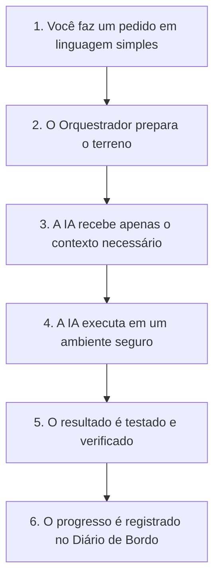

# Guia Simplificado: O que é e Como Funciona o Orquestrador Maestro

Este guia foi feito para qualquer pessoa — mesmo sem experiência técnica avançada — entender exatamente o que é o **Orquestrador Maestro**, por que ele existe e como ele torna o uso de Inteligências Artificiais (IAs) muito mais simples, eficiente e seguro no dia a dia.

---

## 💡 A Ideia Central (Explicação com uma Analogia)

Imagine que você está regendo uma **orquestra de música**:
- **Você é o Maestro**: É você quem decide a música que quer ouvir e dá o tom geral do projeto.
- **As IAs são os Músicos**: Ferramentas brilhantes como ChatGPT, Claude, Cursor, Gemini, OpenCode e Codex são os músicos experientes. Cada um toca um instrumento muito bem.
- **O Orquestrador Maestro é a Partitura e as Regras do Palco**: Sem um caderno de regras claro, cada músico toca do seu jeito, ignora o que o outro acabou de tocar, inventa notas e cria uma confusão.

O **Orquestrador Maestro** garante que **todas as IAs sigam exatamente a mesma partitura** (as regras da sua empresa ou projeto), trabalhem em harmonia e deixem tudo organizado para a próxima IA continuar sem "amnésia".

---

## 🔄 Como Funciona na Prática (Passo a Passo)

Quando você pede algo para uma IA através do Orquestrador Maestro, acontece o seguinte fluxo simplificado:



### 1. Você faz um pedido
Você escreve o que deseja em português claro (ex: *"Crie um sistema de login com e-mail e senha"*).

### 2. O Orquestrador prepara o terreno
Antes de chamar a IA, o Orquestrador verifica:
- Quais são as regras globais e do seu projeto (ex: *"Use Node.js"*, *"Não altere arquivos da pasta X"*).
- Quais ferramentas e habilidades adicionais (*skills*) serão necessárias.

### 3. Economia Inteligente de Contexto
Em vez de enviar todo o código do seu computador para a IA (o que custa caro e deixa a IA confusa), o Orquestrador entrega **apenas o resumo estritamente necessário**.

### 4. Execução Segura
A IA faz o trabalho dentro de uma área isolada (*worktree*). Se a IA errar algo, seu código original **não é quebrado**.

### 5. Verificação Automática
O Orquestrador roda testes para confirmar que o código funciona de verdade e não apenas "no papel".

### 6. Registro no Diário de Bordo (*Worklog*)
Tudo o que foi feito é anotado em um arquivo simples chamado `DEV/WORKLOG.md`. Se amanhã você usar outra IA totalmente diferente, ela lê esse diário e continua exatamente de onde a anterior parou!

---

## 🖥️ As Telas e Formas de Usar

O Orquestrador Maestro oferece formas simples de interação para se adequar ao seu estilo de trabalho:

### 1. O Painel de Controle Visual (Cockpit TUI)
Uma interface visual moderna que roda dentro do seu próprio terminal. Nela você pode:
- Acompanhar múltiplos agentes de IA trabalhando simultaneamente em painéis divididos.
- Alternar entre ferramentas com teclas simples (ex: pressione `A` para escolher a IA, `M` para iniciar uma missão, `S` para abrir um terminal).
- Entrar no terminal com `Enter` e voltar ao painel geral com `Ctrl+]`.

### 2. Comandos Diretos (CLI)
Para quem prefere digitar comandos diretos:
- `orquestrador-maestro tui`: Abre o painel visual.
- `orquestrador-maestro go "minha tarefa"`: Inicia uma missão guiada inteligente.

---

## ⭐ Principais Benefícios para Você

1. **Chega de Repetir Instruções**: Escreva as regras do projeto uma única vez. Todas as IAs passam a obedecê-las automaticamente.
2. **Fim da Amnésia da IA**: A IA sempre sabe o histórico recente e o objetivo atual.
3. **Economia de Tempo e Dinheiro**: Ao enviar apenas o contexto relevante, suas chamadas de IA ficam muito mais rápidas e baratas.
4. **Liberdade de Escolha (Multi-IA)**: Use Claude hoje, ChatGPT amanhã, Gemini ou Cursor depois sem perder o histórico do seu projeto.
5. **Segurança de Dados**: Roda 100% na sua máquina. O Orquestrador não envia seus códigos locais para servidores externos nem faz ações perigosas sem sua permissão.

---

## ❓ Perguntas Frequentes (FAQ)

### O Orquestrador substitui as IAs que eu já uso?
**Não.** Ele trabalha **junto** com as IAs (como Claude, Codex, OpenCode, Gemini, etc.), servindo de ponte e organizador de tarefas.

### Preciso instalar bancos de dados complexos ou servidores externos?
**Não.** O Orquestrador roda inteiramente no seu próprio computador de forma leve e rápida.

### Como faço para instalar?
Basta ter o Node.js instalado e rodar um único comando no terminal:
```bash
npm install -g @iapro/orquestrador-maestro-cli@latest
orquestrador-maestro install
```

---

## 📚 Para onde ir agora?

- [Guia de Instalação Detalhado](installation.md)
- [Solução de Problemas (Troubleshooting)](installation-troubleshooting.md)
- [Referência de Comandos da CLI](orquestrador-reference.md)
