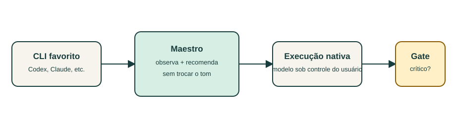
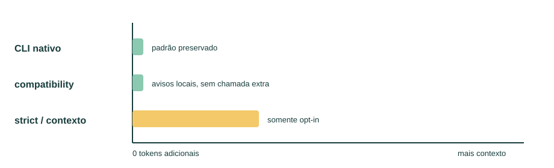

# Maestro: governança compatível

Esta área é para quem quer adicionar governança sem descaracterizar o comportamento nativo da ferramenta. Para entender o produto e instalar o caminho padrão, comece pelo [README](../../README.md).

Esta área descreve a camada opcional do Maestro para usuários que continuam trabalhando diretamente nos CLIs nativos.

## Promessa de compatibilidade

O padrão instalado é conservador:

- o CLI, o provider, o modelo, o perfil e o tom continuam sob controle do usuário;
- o prompt nativo não recebe contexto adicional automaticamente;
- verificações ausentes produzem aviso estruturado, sem transformar uma execução válida em falha;
- recomendações de evidência aparecem apenas quando existem critérios de aceite;
- hooks permanecem desligados até ativação explícita;
- somente riscos críticos ou o modo `strict` podem bloquear uma conclusão.

O diretório canônico de instalação é `~/.orquestrador-maestro`. Instalações existentes em `~/.orquestrador` continuam sendo lidas e atualizadas nesse local até uma migração explícita. Não há renomeação automática.

## Navegação

- [Guia completo](./guide.md)
- [Como testar](./testing.md)
- [Atualização segura e rollback](./upgrade.md)
- [Compatibilidade e custo](./compatibility.md)
- [Modos de governança](./governance-modes.md)
- [Modelos, providers e tom](./models-and-tone.md)
- [Riscos para o usuário final](./user-impact.md)
- [Operação diária e troubleshooting](./operations.md)
- [Configuração de exemplo](./config.example.json)
- [Interaction Profiles](./interaction-profiles.md)

## Visão rápida

Os gráficos são qualitativos: a camada compatível faz apenas leitura e regras determinísticas; não adiciona chamadas de modelo. O custo extra esperado no uso cotidiano é armazenamento de estado e processamento local mínimo. O prompt só cresce quando o usuário ativa `includeGovernanceContext` ou `strict`.

## Princípio de compatibilidade

Uma atualização segura deve ser percebida como uma melhoria operacional, não como uma mudança de personalidade da IA. Por isso, a política padrão mantém `compatibility`, o tom nativo e o provider/modelo escolhidos pelo usuário. Toda mudança de rigor, hook ou contexto adicional é explícita, reversível e observável.
