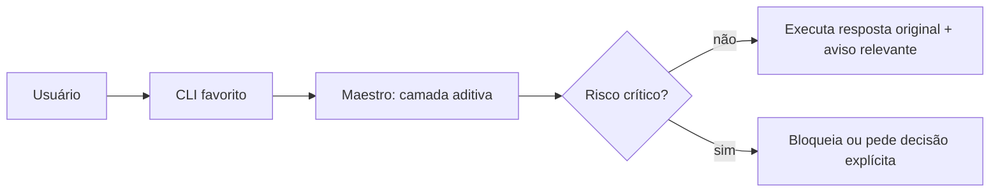

# Compatibilidade e preservação do comportamento

O Maestro adiciona governança sem substituir o CLI nativo. O padrão é `compatibility`:

O pacote suporta Node.js `>=20.0.0`. A matriz obrigatória verifica a suíte full em Linux
com Node 20, 22 e 24, e os caminhos smoke em Windows e macOS com Node 20 e 24. A matriz
é evidência de compatibilidade, não uma promessa de que todos os providers externos
tenham o mesmo suporte entre sistemas operacionais.

- tom, prompts, provider, modelo e perfil nativos permanecem sob controle da ferramenta;
- verificação ausente gera aviso/recomendação, não falha automática;
- findings críticos podem bloquear; orientações não críticas não interrompem tarefas;
- hooks ficam desativados até ativação explícita.

`strict` é opt-in por configuração ou CI e aplica os gates completos existentes. A inclusão do contrato de engenharia no prompt também é opt-in; no modo compatível ele continua apenas no estado persistido e no relatório local.

## Configuração

O primeiro arquivo encontrado é usado, nesta ordem:

1. `.orquestrador-maestro/config.json` no projeto;
2. `.orquestrador/maestro-config.json` no projeto, legado;
3. `~/.orquestrador-maestro/config.json`;
4. `~/.orquestrador/maestro-config.json`, legado.

Exemplo mínimo:

```json
{
  "mode": "compatibility",
  "tone": "preserved",
  "warningFrequency": "once-per-session",
  "hooks": { "enabled": false }
}
```

Para alterar a configuração sem depender dela para executar o CLI favorito:

```bash
orquestrador-maestro governance status --project-path .
orquestrador-maestro governance set --project-path . --mode strict
orquestrador-maestro governance set --project-path . --hooks on --warning-frequency always
```

O comando grava apenas `.orquestrador-maestro/config.json`. A execução nativa continua funcionando sem que esse comando seja chamado.

Na TUI clássica, `g compatibility` e `g strict` fazem a mesma troca no projeto atual; `g` sozinho apenas mostra o formato aceito.

Nenhum arquivo nativo é sobrescrito automaticamente. Migrações devem criar backup, apresentar preview e permitir rollback; conteúdo manual e estado desconhecido permanecem intactos.

## Avisos, custo e integração

Avisos são determinísticos, estruturados fora da resposta original (`governanceWarnings` e `recommendations`) e no máximo uma vez por sessão por padrão. Não fazem chamadas adicionais de IA nem carregam catálogos ou documentação no prompt. Provider e modelo aparecem apenas como informação. Sem critérios de aceite, não há recomendação de evidência.



Rollback restaura somente arquivos gerenciados pelo Maestro a partir do backup correspondente; nunca remove memória, logs, sessões, configurações nativas ou diretórios de terceiros.
