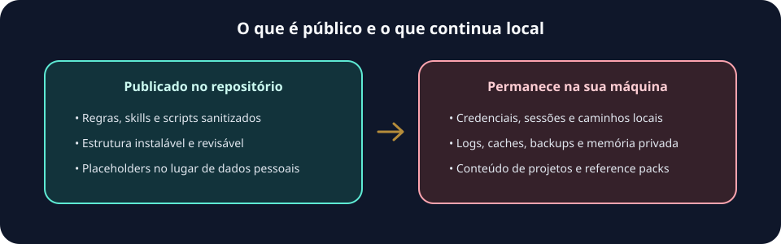

# Modelo de privacidade

O snapshot público compartilha comportamento e estrutura, não o conteúdo privado da máquina original. Você pode revisar o que é instalado sem publicar credenciais, histórico de trabalho ou dados de projetos.



Use este guia para conferir o que entra no repositório, o que permanece local e como funciona a telemetria anônima opt-in (desabilitada por padrão).

## Incluído

- Regras globais do Orquestrador.
- Índices e roteadores de skills.
- Skills canônicas sob `orquestrador/skills`.
- Skills, agentes e prompts Codex sob `codex/`.
- Biblioteca comunitária deduplicada sob `skill-library/community-skills/`, instalada fora das raízes nativas em `.orquestrador/skill-library/community-skills`.
- Hooks e perfis textuais selecionados sob `tool-profiles/`.
- Scripts de manutenção que usam caminhos relativos ao home do usuário.
- Um `AGENTS.md` global sanitizado para instalação.

## Excluído

- Caches e runtimes de ferramentas.
- Logs, backups, relatórios de doctor, memórias e histórico de execução.
- Artefatos operacionais locais como `.omx/`, `.local/` e `DEV/` deste clone.
- Bibliotecas externas, exports de Google Drive, PDFs privados e reference packs locais.
- Configurações com projetos locais, tokens, chaves, credenciais ou caminhos reais.
- Arquivos temporários e cópias `.bak`.
- Dependências vendorizadas como `node_modules` e artefatos de build/runtime.
- Perfis completos de IDE, OAuth, navegador, tracking e sessões de agentes.

## Placeholders

O snapshot público usa placeholders:

- `{{USER_HOME}}`: home do usuário que instalar.
- `{{USER_NAME}}`: nome do usuário local.
- `{{USER_FULL_NAME}}`: nome humano opcional, quando existir na fonte.
- `<PRIVATE_TERM>`: termo privado removido durante o sync.

O instalador substitui esses placeholders por valores da máquina de destino quando copia os arquivos para o home do usuário.

## Reference Packs Locais

Quando o usuário tiver uma biblioteca própria de PDFs, docs ou exports do Drive, o caminho seguro é manter isso em packs locais indexados, fora deste repositório público.

Documentação:

- [docs/reference-packs.md](reference-packs.md)
- `{{USER_HOME}}/.orquestrador/REFERENCE_PACKS.md` depois da instalação

Esses packs são permitidos como contexto local, mas não fazem parte do snapshot publicável.

## Telemetria

O CLI npm mede telemetria anônima mínima somente quando ativada explicitamente (`orquestrador-maestro telemetry enable` + endpoint + chave). Por padrão ela vem desabilitada (opt-in, `consentVersion: 2`; ver `bin/orquestrador-maestro.js: defaultTelemetryConfig`). Quando ativa, usa captura server-side ao PostHog Cloud na região US (Virginia). A finalidade exclusiva é medir adoção e uso técnico. O identificador é um pseudônimo aleatório de instalação, não uma identidade pessoal e não permite afirmar quantas pessoas usam o pacote.

Permitido:

- comando executado;
- flags sem valores;
- versão do pacote;
- plataforma, arquitetura e versão major do Node.js;
- exit code;
- sucesso ou falha;
- identificador anônimo aleatório;
- data UTC arredondada ao dia.

Proibido:

- telefone;
- nome de usuário;
- caminho local;
- conteúdo de projeto;
- tokens, prompts, logs ou nomes de arquivos privados;
- valores de argumentos, IP armazenado pelo produto, cookies, sessão, replay, heatmaps e autocaptura.

Consulte o estado e as instruções simples com:

```bash
orquestrador-maestro telemetry status
```

Depois de um opt-out, reabilite explicitamente com `orquestrador-maestro telemetry enable`.

E pode ser desabilitada com:

```bash
orquestrador-maestro telemetry disable
```

Ou por variável de ambiente:

```bash
ORQUESTRADOR_MAESTRO_TELEMETRY=0
```

O processamento usa o endpoint US do PostHog. O prazo de retenção, eliminação, subprocessadores, transferência internacional e base legal devem ser confirmados pelo mantenedor com orientação jurídica antes do lançamento; esta documentação não afirma conformidade automática.

O registro detalhado de tratamento está em [telemetry-processing-record.md](telemetry-processing-record.md).

## Checagem

Use:

```powershell
powershell -NoProfile -ExecutionPolicy Bypass -File .\scripts\validate-public.ps1
```

A validação procura:

- Caminhos concretos de home local, que devem aparecer como `{{USER_HOME}}` ou `%USERPROFILE%`.
- Nome de usuário local.
- Padrões comuns de segredo, como tokens GitHub, OpenAI, AWS e Slack.
- Diretórios proibidos como `logs` e `backups`.
- Raízes locais privadas como `.omx/`, `.local/` e `DEV/`.
- JSON inválido no snapshot.
