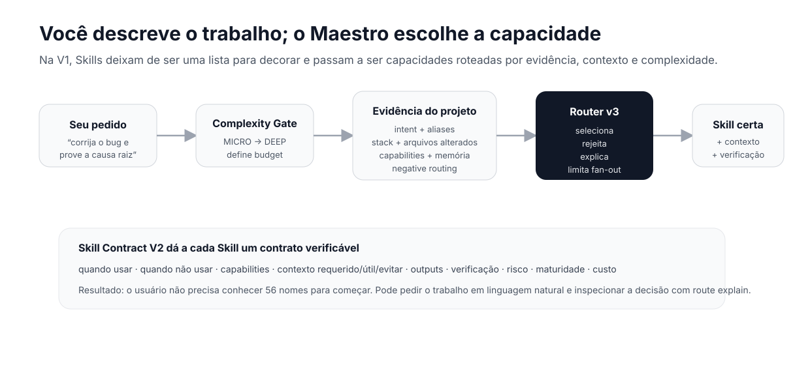

# Skills do Maestro

Skills são **contratos de capacidade** usados pelo Maestro para executar tipos específicos de trabalho com contexto, limites, risco, outputs e verificação proporcionais.

Elas não são modelos, agentes autônomos ou plugins obrigatórios. Uma Skill também não concede autorização para commit, push, publicação, envio de mensagens, pagamentos, scans externos ou ações destrutivas.

A V1 muda a forma de pensar o catálogo:

> Você não escolhe uma Skill porque decorou o nome dela. Você descreve o trabalho; o Maestro classifica a complexidade, lê sinais do projeto e seleciona a capacidade mais adequada.



## Comece aqui

| Se você quer… | Vá para… |
| --- | --- |
| Descobrir o que usar para uma tarefa | [Escolher por objetivo](choose.md) |
| Entender como várias Skills cooperam | [Receitas operacionais](recipes.md) |
| Fazer o primeiro fluxo guiado | [Sua primeira Skill](primeira-skill.md) |
| Consultar uma Skill específica | [Referência completa](reference/README.md) |
| Auditar o catálogo compacto | [Catálogo gerado](../skill-catalog.md) |
| Entender runtime, routing e CLI | [Referência técnica](../orquestrador-reference.md) |

## Modelo mental

A decisão da V1 acontece em camadas:

```text
pedido
  ↓
Complexity Gate
  ↓
sinais do projeto
  ├─ stack
  ├─ arquivos alterados
  ├─ capabilities
  └─ memória verificada, quando aplicável
  ↓
Skill Contract V2
  ├─ useWhen
  ├─ doNotUseWhen
  ├─ context
  ├─ outputs
  ├─ verification
  ├─ risk
  └─ costProfile
  ↓
Router v3
  ├─ seleciona
  ├─ rejeita
  ├─ limita chaining/fan-out
  └─ explica a decisão
  ↓
execução
  ↓
Verification / Resolution
```

Isso evita dois extremos:

- carregar muitas Skills “por garantia”;
- escolher uma Skill apenas porque uma palavra do pedido apareceu em um trigger.

## O catálogo hoje

A linha V1 possui:

| Grupo | Quantidade | Papel |
| --- | ---: | --- |
| **Maestro Core** | 15 | capacidades transversais de engenharia, qualidade, governança e entrega |
| **Maestro Domain** | 41 | capacidades especializadas como frontend, segurança, IA, SaaS, pagamentos e mídia |
| **Canônicas Maestro** | **56** | Core + Domain, todas no Manifest V3 / Skill Contract V2 |
| **Públicas únicas** | **79** | catálogo deduplicado distribuído, incluindo conteúdo externo/comunitário |

Os números são consequência do catálogo atual; eles não são meta de produto. O objetivo é aumentar cobertura **sem aumentar contexto desnecessário**.

## Core, Domain e externas

### Maestro Core

Skills com `origin: maestro-core` representam capacidades fundamentais que fazem sentido em muitos projetos.

Exemplos:

- `skill-preflight`
- `skill-repo-health`
- `skill-systematic-debugging`
- `skill-engineering-quality`
- `skill-database-migrations`
- `skill-verification-before-completion`
- `skill-release-engineering`
- `skill-adr`

Elas implementam Skill Contract V2 nativamente e podem participar do routing automático.

### Maestro Domain

Skills com `origin: maestro-domain` concentram conhecimento especializado.

Exemplos:

- frontend e UX;
- segurança;
- IA e agentes;
- SaaS e pagamentos;
- integrações;
- mídia;
- analytics;
- compliance.

Também implementam Skill Contract V2 nativamente, mas só devem ser selecionadas quando houver evidência suficiente para o domínio.

### Library / External

Skills externas ou comunitárias continuam podendo usar seus formatos próprios. O Registry as normaliza na fronteira de compatibilidade.

A presença no catálogo **não autoriza auto-routing**. Quando não existe routing confiável, a Skill permanece `explicit-only`.

### User / Project

Skills locais do usuário ou do projeto não precisam adotar o manifesto interno do Maestro. Elas permanecem sob controle local e são tratadas como não verificadas por padrão, salvo evidência de distribuição confiável.

## Workflow não é origem de Skill

Workflows e superfícies de execução — incluindo capacidades OMX como `plan`, `team`, `ralph` ou `ultrawork` quando disponíveis — podem **usar** Skills, mas não são uma quarta origem de Skill.

A separação correta é:

```text
Skill = conhecimento + contrato + routing + verificação
Workflow = sequência/estratégia de execução
Agent/provider = quem executa
Recipe = combinação declarativa de capacidades
```

Isso evita duplicar o mesmo conhecimento em quatro formatos diferentes.

## Como o Router v3 decide

O Router v3 começa classificando a complexidade em:

`MICRO | SIMPLE | STANDARD | COMPLEX | DEEP`

Essa classificação define limites como quantidade máxima de Skills, budget de contexto, profundidade de planejamento e se subagents sequer podem ser considerados.

Depois, o Router reúne evidências.

### Evidências fortes

1. invocação explícita, como `/skill:skill-repo-health`;
2. alias exato;
3. `routing.useWhen` exato;
4. alias específico contido na frase;
5. `routing.useWhen` específico contido na frase;
6. rota por capability.

### Sinais do projeto

Quando disponíveis, também entram no score:

- stack detectada;
- capabilities derivadas da stack;
- arquivos alterados;
- capabilities derivadas do escopo;
- hints de memória verificada;
- contexto obrigatório ausente.

### Evidência negativa

`routing.doNotUseWhen` impede que uma Skill vença apenas por coincidência textual.

Exemplo:

- “audite a saúde geral deste repositório” pode apontar para `skill-repo-health`;
- “há um bug reproduzível neste teste” deve favorecer `skill-systematic-debugging`, mesmo que ambas tratem engenharia/qualidade.

### Budget e chaining

Uma Skill principal pode encadear Skills permitidas somente quando:

- existe evidência para elas;
- a chain é permitida;
- o budget da complexidade comporta mais Skills.

Fan-out de agentes possui uma proteção adicional: `COMPLEX` ou `DEEP` **não habilita multiagent sozinho**. O pedido precisa conter intenção explícita de delegação/subagents.

## Inspecione a decisão

Use:

```bash
orquestrador-maestro route explain "investigue por que este teste está falhando"
```

Ou em formato estruturado:

```bash
orquestrador-maestro route explain --json "prepare esta aplicação para release"
```

A resposta pode mostrar:

- `routingVersion`;
- `complexity`;
- `primarySkill`;
- `chainedSkills`;
- `confidence`;
- `matchedEvidence`;
- sinais de stack e escopo;
- rotas rejeitadas e motivo;
- `estimatedContextTokens`;
- `contextBudget`.

O comando é a forma preferida de entender por que o Maestro escolheu uma Skill. A referência humana ajuda a descobrir capacidades, mas o Router é a fonte operacional da decisão.

## Um exemplo completo

Pedido:

```text
“investigue por que o build começou a falhar depois dessa alteração e corrija a causa raiz”
```

O fluxo esperado é aproximadamente:

```text
Complexity Gate
  ↓
stack + changed files
  ↓
evidência de debugging
  ↓
skill-systematic-debugging
  ↓
contexto de failing behavior + arquivos relacionados
  ↓
correção
  ↓
verificação
```

Isso é diferente de carregar `repo-health`, frontend, release, security e outras Skills “por garantia”.

## Disponibilidade não é a mesma coisa que routing

A referência pode usar estes estados de distribuição:

| Estado | Significado |
| --- | --- |
| **Nativa** | espelhada nas raízes nativas mantidas pelo sync e descoberta diretamente pelo client |
| **Sob demanda** | registrada no Maestro e carregável quando a tarefa pede, sem ocupar todas as raízes nativas |
| **Condicional** | depende de ferramenta, serviço, sistema operacional, credencial ou autorização explícita |
| **Não suportada** | existe incompatibilidade comprovada |

Uma Skill pode estar **disponível** e ainda assim não ser elegível para auto-routing por falta de evidência confiável.

## Como ler uma página de Skill

As páginas em `reference/` são geradas do manifesto. Para humanos, leia nesta ordem:

1. **Descrição / melhores casos de uso** — serve para o problema?
2. **Quando não usar** — existe uma rota mais específica?
3. **Pré-requisitos** — falta autorização, ferramenta ou baseline?
4. **Contexto** — o que precisa ser carregado e o que deve ser evitado?
5. **Outputs** — qual resultado concreto a Skill deve produzir?
6. **Verificação** — que evidência precisa existir antes de aceitar como concluído?
7. **Disponibilidade** — onde e como a Skill pode ser carregada.

A [referência completa](reference/README.md) é catálogo; o [guia por objetivo](choose.md) é navegação.

## Quando combinar Skills

Use uma única Skill quando:

- um domínio cobre o resultado;
- há um output claro;
- a verificação cabe nessa capacidade.

Use uma [receita](recipes.md) ou chain quando:

- existem dependências reais entre etapas;
- a evidência final exige disciplinas distintas;
- uma etapa produz contexto necessário para a próxima.

Skills de apoio não entram por hábito.

## Fontes de verdade

A hierarquia operacional é:

```text
runtime
  ↓
SKILLS_MANIFEST.json
  ↓
SKILLS_ROUTER.json / aliases / chains
  ↓
catálogo e páginas geradas
  ↓
documentação narrativa
```

Arquivos principais:

- [Manifest V3](../../orquestrador/SKILLS_MANIFEST.json)
- [Router](../../orquestrador/SKILLS_ROUTER.json)
- [Aliases](../../orquestrador/SKILL_ALIASES.json)
- [Chains](../../orquestrador/SKILL_CHAINS.json)
- [Execution Profiles](../../orquestrador/SKILL_EXECUTION_PROFILES.json)
- [Catálogo público deduplicado](../../skill-library/PUBLIC_SKILLS_MANIFEST.json)

Após instalação, `~/.orquestrador/SKILLS_DISCOVERY.json` mantém o inventário público descoberto.

## Contrato V1

Skills `maestro/*` não possuem fallback para o manifesto canônico 0.x.

A fonte única do contrato V2 usa:

- `origin`;
- `maturity`;
- `capabilities`;
- `routing.useWhen`;
- `routing.doNotUseWhen`;
- `context.required/useful/avoid`;
- `outputs`;
- `verification`;
- `costProfile`.

Skills externas, de usuário ou projeto continuam compatíveis pelos seus formatos próprios e são normalizadas na fronteira do Registry.
